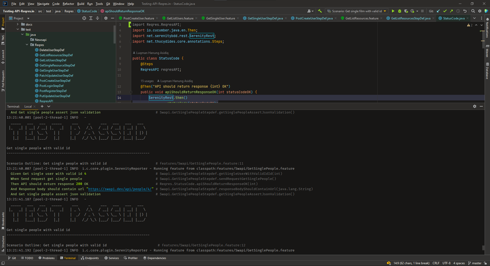
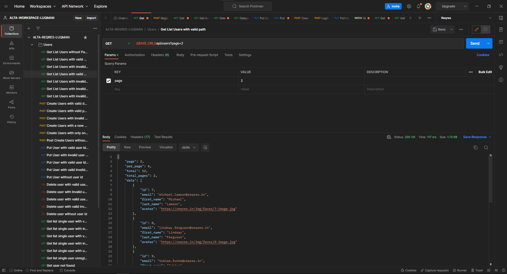

<div align="center">
  <a href="https://github.com/Luqmanhanung/Testing-API-Reqres.git">
    
  </a>

  <p align="center">
    <br />
    <a href="https://reqres.in/"><strong>| Open API Documentation |</strong></a>
    <br />
    <br />
  </p>
</div>

## 📑 About the Project

<p align="justify">The Reqres API is a hosted REST API that provides tools for responding to AJAX requests. Users can test front end applications against a real API. It conforms to REST principles and simulates real application scenarios such as testing a user authentication system.</p>

## 📓 Testing Documentation
[Test Case API](https://docs.google.com/spreadsheets/d/1AjQyzyVwfTlN9zQEYH_L-6fL0M7_bdGfqyh5BGZvCWU/edit?usp=sharing)

## 📝 Reports


#### Summary Report


#### Coverage Report


#### Test Documentation Snippet


#### Automation Testing When Run in Intellij IDE


#### Manual Testing When Run in Postman


## 🛠 Tools
**Manual:**


**Automation:**  


**Test Case Management:**


## 🏎️ How to Run all Test Scenarios

1. Clone the repository
```bash
  $ git clone https://github.com/Luqmanhanung/Testing-API-Reqres.git
```
2. Open  this Project Repository on Intellij IDE and Run this on the IDE terminal

```bash
  $ mvn clean verify
```


## 📱 Project By

[](https://www.linkedin.com/in/luqman-hanung-asidiq/)
[](https://github.com/Luqmanhanung/)

<h5>
<p align="center">:copyright: 2022 | This Repository Built with :heart: from us</p>
</h5>
